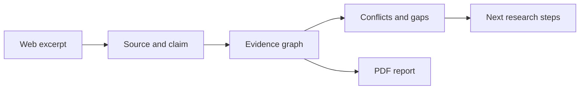

# THREAD

**Keep the evidence behind your research.**

THREAD captures excerpts from the web, preserves their source context, and connects them in a research workspace. Compare claims, investigate contradictions, identify missing evidence, and export a report with traceable sources.

[Project deployment](https://thread-research-intelligence.sujeethsai265.chatgpt.site) · [Setup & deployment guide](docs/SETUP.md) · [Browser extension](apps/extension) · [Tests](tests)

Built by **Team Rockers**.

## What you can do

- **Capture with context.** Save selected text with its URL, source metadata, and research project through a Manifest V3 browser extension.
- **Connect the evidence.** Explore relationships between sources and claims in a React Flow graph.
- **Investigate disagreements.** Review contradictions and contextual tensions, then record a resolution or retain uncertainty.
- **Find the next question.** Turn coverage gaps into research tasks instead of treating a short summary as completed research.
- **Export the record.** Generate a PDF with findings, limitations, evidence, and citations.



## Try it locally

Requires **Node.js 22+** and npm. This evaluation mode stores data on your own machine and does not require a shared test account.

```bash
git clone https://github.com/Sujeeth-Sai/Thread-AI.git
cd Thread-AI
npm ci
cp .env.example .env.local
```

Set these values in `.env.local`:

```ini
GUEST_MODE=true
OPEN_ACCESS=false
NEXT_PUBLIC_APP_URL=http://localhost:3000
```

```bash
npm run dev
```

Open [localhost:3000](http://localhost:3000). Local research is stored in the ignored `.thread/guest-data.json` file. Guest mode is for isolated local evaluation; use authenticated Supabase storage for a shared deployment.

OpenAI analysis and research discovery are optional integrations. Without configured keys, available fallback analysis is more limited. See the [environment guide](docs/SETUP.md#environment-variables) for the full configuration.

## A useful first walkthrough

1. Create a project around one research question.
2. Add an excerpt and inspect its source and extracted claim.
3. Add related evidence from another source.
4. Review the graph, conflicts, and missing context.
5. Export a report and check that each conclusion can be traced back to evidence.

For capture from other websites, build and install the [browser extension](docs/SETUP.md#browser-extension).

## How it is built

| Layer | Implementation |
| --- | --- |
| Web application | React, TypeScript, Next.js-compatible routes through Vinext |
| Persistence and accounts | Supabase Postgres, Auth, and SQL migrations with RLS |
| Analysis | OpenAI integration plus deterministic extraction and comparison helpers |
| Research interface | React Flow, Recharts, source and claim detail views |
| Reports | PDFKit |
| Browser capture | Chromium/Brave Manifest V3 extension |

Start with [`lib/analysis`](lib/analysis) for claim extraction, contradiction classification, source intelligence, and research health. [`lib/repository.ts`](lib/repository.ts) handles persistence; [`lib/report.ts`](lib/report.ts) builds the PDF.

## Quality checks

```bash
npm test
npm run check
```

The tests cover claim extraction, contradiction classification, research health, source intelligence, API schemas, and PDF generation. `npm run check` also runs lint, builds the extension, and builds the application. These commands describe the repository's checks; a passing local run does not establish live authentication or browser capture behavior.

## Boundaries

AI-generated relationships are suggestions for a researcher to review. Research-health scores describe evidence coverage, not whether a conclusion is true. Metadata, DOI matches, and publisher information provide context rather than a guarantee of source quality. Browser capture also depends on page structure and extension permissions.

For Supabase setup, extension installation, environment variables, API routes, and hosting, see [the full setup guide](docs/SETUP.md).

## Contributing

Useful contributions include reproducible capture failures, false contradiction examples, source-metadata edge cases, and regression tests. For a bug report, include reproduction steps and redacted sample evidence.
