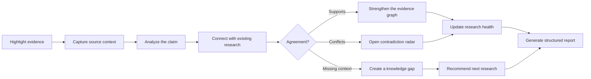

<div align="center">

# THREAD

### AI Research Intelligence

Turn scattered sources into a living evidence graph that connects claims, preserves provenance, surfaces contradictions, explains knowledge gaps, and recommends what to investigate next.

[](https://thread-research-intelligence.sujeethsai265.chatgpt.site)
[](https://thread-research-intelligence.sujeethsai265.chatgpt.site/thread-extension.zip)


**Built by Team Rockers**

</div>

---

## The problem

Research becomes fragmented when useful information is spread across websites, papers, PDFs, and notes. Researchers repeatedly summarize and reorganize the same material, while source context gets lost, conflicting claims remain unnoticed, and incomplete research can appear finished.

THREAD replaces that manual workflow with a traceable research system in which every conclusion remains connected to its evidence.

## How THREAD works



1. **Capture** — Highlight text on a webpage or document and click the THREAD button.
2. **Understand** — Extract the claim, source metadata, document type, stance, method, context, and limitations.
3. **Connect** — Compare new evidence with the claims already stored in the selected research project.
4. **Challenge** — Separate supporting evidence, genuine contradictions, contextual tensions, and unresolved uncertainty.
5. **Investigate** — Explain weak coverage and convert knowledge gaps into ranked next-research tasks.
6. **Report** — Export the complete research record as a structured PDF with traceable sources and evidence.

## Features

| Area | What it does |
| --- | --- |
| **Universal browser capture** | Captures selected text from normal websites, research portals, localhost deployments, PDFs, and other browser-accessible documents. |
| **Project-aware saving** | Suggests the most relevant project while supporting multiple parallel research projects. |
| **Source intelligence** | Records authors, publisher, journal, publication date, DOI, document type, canonical citation, PDF link, and available authenticity signals. |
| **Evidence graph** | Visualizes the relationships between sources, evidence, claims, findings, conflicts, and gaps. |
| **Contradiction radar** | Detects disagreements, shows both sides, and lets the researcher finalize a supported conclusion or retain uncertainty. |
| **Knowledge-gap analysis** | Explains what is missing, why it matters, and which investigation could improve coverage. |
| **Research health** | Measures evidence depth, source credibility, diversity, methodology, citations, topic coverage, and unresolved uncertainty without pretending that a few excerpts equal 100% completion. |
| **Next Moves** | Converts gaps and weak evidence into prioritized research tasks. |
| **Research Library** | Keeps sources, excerpts, claims, relationships, insights, conflicts, gaps, tasks, and timeline events in one searchable record. |
| **Structured reports** | Produces a downloadable PDF organized around the question, evidence, findings, limitations, contradictions, gaps, citations, and next steps. |
| **Real persistence** | Uses account-scoped Supabase storage in production and an optional local JSON store for isolated development. |
| **Delete and resolve controls** | Supports deleting projects or individual research items and recording contradiction-resolution decisions. |

## Research health is not a completion percentage

THREAD does not mark research as “complete” because a few paragraphs were added. Its readiness model evaluates multiple dimensions independently:

- background and scope;
- population, sample, or setting;
- methods and research design;
- outcomes and findings;
- limitations and counter-evidence;
- source credibility and diversity;
- citation completeness;
- unresolved contradictions;
- coverage of the important aspects of the research question.

Low scores remain visible so that missing evidence is treated as research work, not hidden by a polished summary.

## Technology

- **Application:** Next.js 16, React 19, TypeScript, Vinext, Vite
- **Interface:** Astryx Design System, StyleX, Lucide icons
- **Database and authentication:** Supabase Postgres, Supabase Auth, Row Level Security
- **AI analysis:** OpenAI Responses API with a grounded deterministic fallback
- **Research discovery:** Tavily Search API and scholarly metadata enrichment
- **Visualization:** React Flow and Recharts
- **Reports:** PDFKit
- **Browser integration:** Chromium/Brave Manifest V3 extension with a service worker, content script, popup, and side panel
- **Hosting:** ChatGPT Sites/Cloudflare-compatible Vinext build; Next.js build path for Vercel

## Quick start

### Prerequisites

- Node.js 20 or newer
- npm
- A Supabase project for authenticated persistence
- Optional OpenAI and Tavily API keys

### 1. Install

```bash
git clone <your-repository-url>
cd thread-research-intelligence
npm ci
cp .env.example .env.local
```

### 2. Choose a data mode

#### Fast local evaluation

Set this in `.env.local`:

```ini
GUEST_MODE=true
NEXT_PUBLIC_APP_URL=http://localhost:3000
```

This stores local research in the ignored `.thread/guest-data.json` file. It is intended only for isolated development.

#### Production-style authentication

Keep `GUEST_MODE=false`, configure Supabase, and apply every SQL file in `supabase/migrations/` in filename order. New accounts and projects start empty; `supabase/seed.sql` intentionally inserts no demo data.

### 3. Run

```bash
npm run dev
```

Open [http://localhost:3000](http://localhost:3000).

## Environment variables

| Variable | Required | Purpose |
| --- | --- | --- |
| `NEXT_PUBLIC_SUPABASE_URL` | Production | Supabase project URL used by browser and server clients. |
| `NEXT_PUBLIC_SUPABASE_PUBLISHABLE_KEY` | Production | Supabase publishable key. Safe to expose to the browser when RLS is correctly configured. |
| `SUPABASE_URL` | Optional | Server/admin alias for the Supabase project URL. |
| `OPENAI_API_KEY` | Optional | Enables OpenAI evidence analysis, comparison, verification, and insight generation. |
| `OPENAI_MODEL` | Optional | OpenAI model name; defaults to `gpt-5-mini`. |
| `SEARCH_API_KEY` | Optional | Enables Tavily-backed research discovery. |
| `NEXT_PUBLIC_APP_URL` | Recommended | Canonical URL used by the website and browser extension. |
| `EXTENSION_ALLOWED_ORIGINS` | Recommended | Comma-separated origins allowed to call extension-facing API routes. |
| `GUEST_MODE` | Local only | Uses `.thread/guest-data.json` instead of Supabase. |
| `OPEN_ACCESS` | Specialized | Opens one configured workspace without the normal authentication UI. Do not enable for a normal multi-user deployment. |
| `PUBLIC_WORKSPACE_OWNER_ID` | With open access | Supabase user ID that owns the open workspace. |
| `SUPABASE_SERVICE_ROLE_KEY` | Server/admin only | Reserved for trusted server-side administration. Never expose or commit it. |

> Never commit `.env.local`, API keys, Supabase service-role keys, or private credentials.

## Supabase setup

The migrations create an account-scoped research model with Row Level Security. The main records include:

- users and projects;
- sources and evidence;
- claims and claim relationships;
- insights, contradictions, and contradiction resolutions;
- research gaps and ranked tasks;
- search results and timeline events;
- vector embeddings for semantic retrieval.

Apply every migration in `supabase/migrations/` in order. The final migration removes anonymous table access and requires authenticated users for the normal production workflow.

### Authentication providers

Email/password authentication works through Supabase Auth. To enable Google or GitHub:

1. Enable the provider in **Supabase Dashboard → Authentication → Providers**.
2. Add the provider client ID and secret.
3. Register `https://YOUR_PROJECT.supabase.co/auth/v1/callback` with the provider.
4. Add the local, ChatGPT Sites, or Vercel URL to **Authentication → URL Configuration**.

## Browser extension

The extension supports Brave and Chromium browsers using Manifest V3.

### Build the extension

```bash
npm run extension:build
```

This creates:

- `apps/extension/dist/` — unpacked development extension;
- `apps/extension/thread-extension.zip` — distributable ZIP;
- `public/thread-extension.zip` — website download artifact.

### Install in Brave

1. Open `brave://extensions`.
2. Enable **Developer mode**.
3. Choose **Load unpacked**.
4. Select `apps/extension/dist`.
5. Enable **Allow access to file URLs** if you need to capture text from local PDFs or files.
6. Open the matching THREAD website and sign in before capturing evidence.

After rebuilding or updating the extension, click **Reload** on the extensions page and refresh previously open tabs. This prevents stale content scripts and “extension context invalidated” errors.

### Deployment discovery

The same extension can work with:

- `http://localhost:3000` or another local THREAD URL;
- a Vercel deployment;
- a ChatGPT Sites deployment;
- another compatible HTTP/HTTPS deployment.

When a THREAD page is opened, the content script verifies `/api/extension/config` and stores that origin as the active backend. Mutations can be relayed through the open, authenticated website tab so session cookies stay on the correct deployment.

## Available commands

| Command | Purpose |
| --- | --- |
| `npm run dev` | Start the Vinext development server. |
| `npm run build` | Create the ChatGPT Sites/Cloudflare-compatible production build. |
| `npm run build:next` | Create the standard Next.js build used for platforms such as Vercel. |
| `npm run start` | Start the Vinext production server. |
| `npm run extension:build` | Type-check, bundle, and ZIP the browser extension. |
| `npm run lint` | Run ESLint. |
| `npm test` | Run the Vitest suite once. |
| `npm run check` | Run lint, tests, extension build, and application build. |

## Repository structure

```text
.
├── app/                     # Pages, layouts, authentication, and API routes
│   ├── (app)/               # Authenticated research workspace routes
│   └── api/                 # Projects, evidence, analysis, search, reports, auth
├── apps/extension/          # Brave/Chromium Manifest V3 extension
├── components/              # Product screens and interactive UI
├── lib/
│   ├── analysis/            # Claims, contradictions, health, source intelligence
│   ├── supabase/            # Browser, server, and session helpers
│   ├── ai.ts                # AI and deterministic analysis paths
│   ├── repository.ts        # Supabase and local guest persistence
│   └── report.ts            # Structured research PDF generation
├── packages/shared/         # Shared website/extension types
├── public/                  # Fonts and downloadable extension
├── supabase/
│   ├── migrations/          # Schema, RLS, cleanup, and source intelligence
│   └── seed.sql             # Intentionally empty production seed
└── tests/                   # Unit and component tests
```

## API surface

The app exposes authenticated routes for:

- projects and active-project switching;
- sources, evidence, claims, and research-item deletion;
- evidence analysis, comparison, and verification;
- contradiction resolution;
- graph and timeline data;
- knowledge gaps and next-research tasks;
- research search and result decisions;
- structured PDF reports;
- extension compatibility and CORS preflight handling.

All mutation payloads are validated with Zod. API routes include rate limiting, consistent error handling, and origin-aware CORS headers for the browser extension.

## Security notes

- Supabase RLS scopes research records to the authenticated project owner.
- The anonymous database role is not granted access in the production migration.
- Publishable Supabase keys may be used in the browser; service-role and AI keys must remain server-only.
- Extension origins should be narrowed to the installed production extension ID before a public release.
- Source authenticity scores are explainable provenance signals—not proof that a source is true or methodologically sound.
- Generated reports retain uncertainty and missing metadata instead of inventing citations.

## Deployment

### ChatGPT Sites

The repository contains `.openai/hosting.json` and builds with:

```bash
npm run build
```

Production: [thread-research-intelligence.sujeethsai265.chatgpt.site](https://thread-research-intelligence.sujeethsai265.chatgpt.site)

### Vercel

1. Import the Git repository into Vercel.
2. Set the build command to `npm run build:next`.
3. Add the production environment variables.
4. Set `NEXT_PUBLIC_APP_URL` to the final Vercel URL.
5. Add that URL to Supabase Auth URL Configuration.

## Verification before a release

```bash
npm run check
```

For the extension, also verify the complete browser flow after installation:

1. open and sign in to a THREAD deployment;
2. create or select a research project;
3. highlight text on another website;
4. click **THREAD** and choose the project;
5. confirm the evidence, source, relationship, health score, and activity timeline update.

---

<div align="center">

**THREAD turns scattered information into connected, traceable, and defensible research.**

</div>
